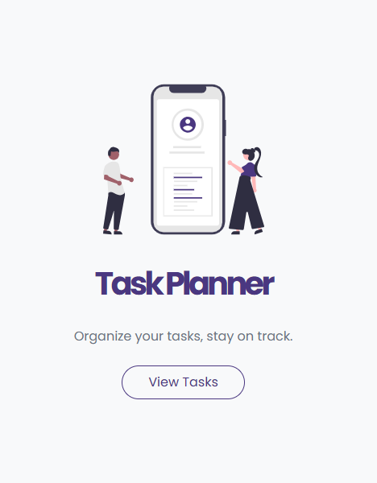
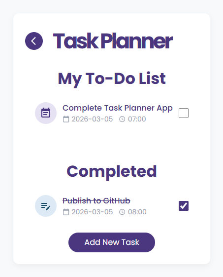
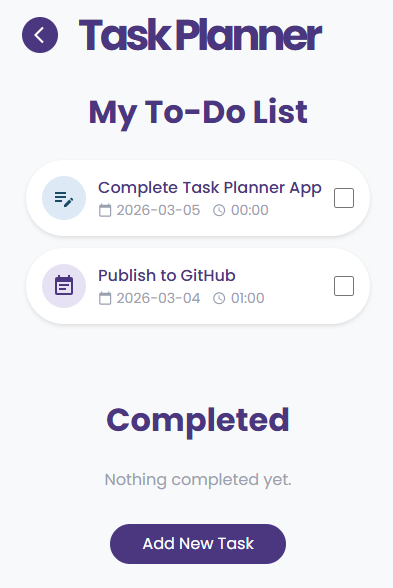
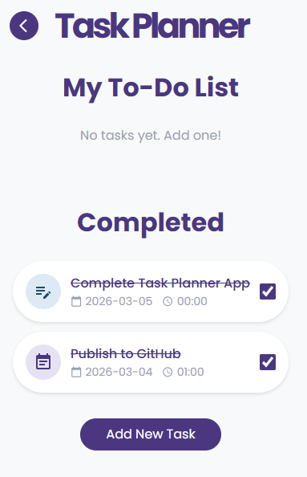
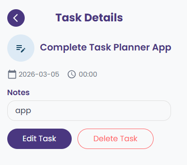
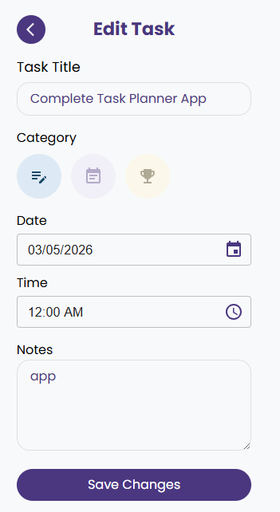
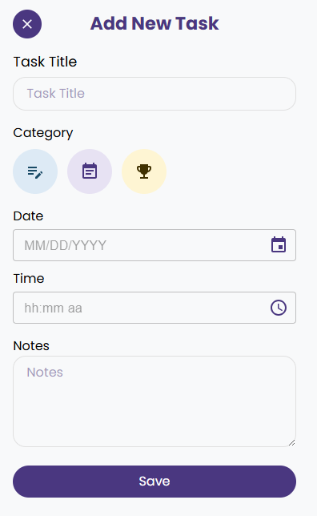

# 📋 Task Planner - Async Redux & Persistent Task Management

A clean and intuitive task management application built with **React** and **Redux Toolkit**. Features full **CRUD operations** via a REST API, category-based task organization, and persistent state management with **Redux Persist**.

## 🔗 Live Demo

_https://hales-task-planner.vercel.app/_

## 📸 Screenshots

| Home Page                                      | Tasks Overview                         |
| ---------------------------------------------- | -------------------------------------- |
|  |  |

| Tasks                                  | To-Do List                                   | Completed Tasks                                      |
| -------------------------------------- | -------------------------------------------- | ---------------------------------------------------- |
|  |  |  |

| Task Details                                         | Edit Task                                      | Add New Task                                     |
| ---------------------------------------------------- | ---------------------------------------------- | ------------------------------------------------ |
|  |  |  |

## ✨ Key Features

- **✅ Full Task Management:** Create, read, update, and delete tasks via a live **MockAPI** backend.

- **🗂️ Category System:** Organize tasks under three categories — **Study**, **Meeting**, and **Activity** — each with distinct color-coded icons.

- **📅 Due Date & Time:** Assign optional due dates and times to tasks using **MUI Date/Time Pickers**.

- **🔄 Asynchronous Data Flow:** Managed with `createAsyncThunk` to handle all API states (Pending / Fulfilled / Rejected).

- **💾 Persistent State:** Task data is preserved across page refreshes using **Redux Persist** with `localStorage`.

- **⏳ Seamless UX:** Global loading spinner using **MUI CircularProgress** during all API operations.

- **📝 Form Validation:** Task title is required, enforced via **Formik** and **Yup** schema validation.

- **📭 Empty State Messages:** Informative placeholders shown when the To-Do or Completed lists are empty.

## 🛠️ Technologies Used

- **React 19 + Vite:** Modern frontend build setup with fast HMR ⚡

- **Redux Toolkit:** (Slices, Store, Async Thunks, Persist) 🧠

- **React Router DOM v7:** Client-side routing across pages 🛣️

- **Tailwind CSS v4:** Utility-first styling for a responsive layout 🎨

- **Material UI v7:** Icon library and Date/Time Picker components 🗓️

- **Formik & Yup:** Robust form management and schema-based validation 📋

- **Axios:** Centralized HTTP client for all API requests 📡

- **Day.js:** Lightweight date/time parsing and formatting 📆

## 🔍 Technical Highlights

### 🏗️ Redux Architecture

The application uses a dedicated `tasks` slice with `extraReducers` handling all async states. The `isLoading` flag drives the global spinner, and the `items` array is persisted to `localStorage` so tasks survive page refreshes without a refetch.

### ⚡ Selector Layer

Reusable selectors (`selectAllTasks`, `selectIsLoading`) decouple the component layer from the store shape, keeping components clean and maintainable.

### 🎨 Category-Driven Design

Each task carries a `category` value (study / meeting / activity) that maps to a color-coded icon rendered consistently across the task list, task details, and edit views.

### 🔒 Production-Ready Forms

Forms are managed with **Formik** and validated with **Yup**. Required field enforcement prevents empty tasks from being submitted to the API — a lesson learned in production! 😄

## 🚀 Getting Started

1. Clone the repository:

```bash
git clone https://github.com/halenurgurel/task-planner.git
cd task-planner
```

2. Install dependencies:

```bash
npm install
```

3. Start the development server:

```bash
npm run dev
```

## 📁 Project Structure

```
src/
├── components/       # AddTask, EditTask, TaskDetails, Loader
├── pages/
│   ├── HomePage/     # Landing page
│   └── TasksPage/    # Main task list (To-Do + Completed)
├── redux/
│   ├── tasks/        # slice, operations, selectors
│   └── store.js      # Redux store with persist config
└── constants/        # Category definitions (icons, colors)
```

## 🌐 API

- **Base URL:** `https://mockapi.io/`
- **Endpoint:** `/tasks`
- **Methods:** `GET` · `POST` · `PUT` · `DELETE`

## Author

**Halenur Gurel** — _React & Redux Development Project_ 🚀

_🎯 "Focused on building clean, maintainable React applications with async state management, persistent storage, and intuitive UX."_
